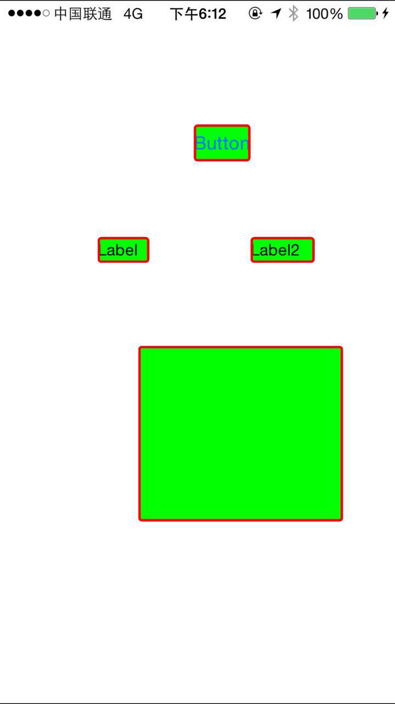

# StyleSheet

[](https://travis-ci.org/dongzhao/StyleSheet)
[](http://cocoapods.org/pods/StyleSheet)
[](http://cocoapods.org/pods/StyleSheet)
[](http://cocoapods.org/pods/StyleSheet)

## Usage

To run the example project, clone the repo, and run `pod install` from the Example directory first.

## Requirements

## Installation

StyleSheet is available through [CocoaPods](http://cocoapods.org). To install
it, simply add the following line to your Podfile:

```ruby
pod "StyleSheet"
```


##What's wrong with origin method?
###繁琐的配置
如果要实现下面这个效果，两个label，一个button，一个view

基于原有的配置大概要写

```
    self.label.layer.cornerRadius = 3;
    self.label.textColor = [UIColor darkTextColor];
    self.label.font = [UIFont systemFontOfSize:13];
    self.label.backgroundColor = [UIColor greenColor];
    self.label.layer.borderWidth = 2;
    self.label.layer.borderColor = [UIColor redColor].CGColor;
    
    
    self.label2.layer.cornerRadius = 3;
    self.label2.textColor = [UIColor darkTextColor];
    self.label2.font = [UIFont systemFontOfSize:13];
    self.label2.backgroundColor = [UIColor greenColor];
    self.label2.layer.borderWidth = 2;
    self.label2.layer.borderColor = [UIColor redColor].CGColor;
    
    
    self.button.layer.cornerRadius = 3;
    self.button.backgroundColor = [UIColor greenColor];
    self.button.layer.borderWidth = 2;
    self.button.layer.borderColor = [UIColor redColor].CGColor;
    
    self.aView.layer.cornerRadius = 3;
    self.aView.backgroundColor = [UIColor greenColor];
    self.aView.layer.borderWidth = 2;
    self.aView.layer.borderColor = [UIColor redColor].CGColor;
```

使用StyleSheet：


```
self.label.style = DZLabelStyleMake(
                                        style.backgroundColor = [UIColor greenColor];
                                        style.cornerRedius = 3;
                                        style.borderColor = [UIColor redColor];
                                        style.borderWidth = 2;
                                        style.textStyle.textColor = [UIColor darkTextColor];
                                        style.textStyle.font = [UIFont systemFontOfSize:13];
    );
    self.label2.style = self.label.style;
    self.aView.style = self.label.style;
    [self.button.style copyAttributesWithStyle:self.label.style];
```

##通用样式的共享
使用原有的配置，进行通用样式的共享是个非常困难的事情，基本上都是体力活，靠人力来维护。我们的代码中会掺杂大量的用于配置样式的代码，而且是独立且散在。

现在你可以通过StyleSheet解决：
###定义共享的样式：

```
EXTERN_SHARE_LABEL_STYLE(Content)

IMP_SHARE_LABEL_STYLE(Content,
                      style.backgroundColor = [UIColor clearColor];
                      style.cornerRedius = 2;
                      style.textStyle.textColor = [UIColor redColor];
                      )
```

###使用共享样式

```
self.label.style =  DZStyleContent();
```
## Author

dongzhao, yishuiliunian@gmail.com

## License

StyleSheet is available under the MIT license. See the LICENSE file for more info.
